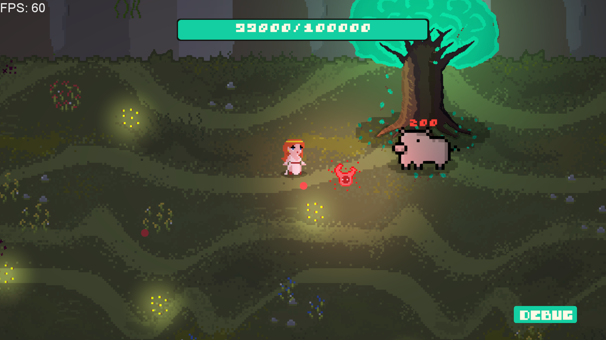
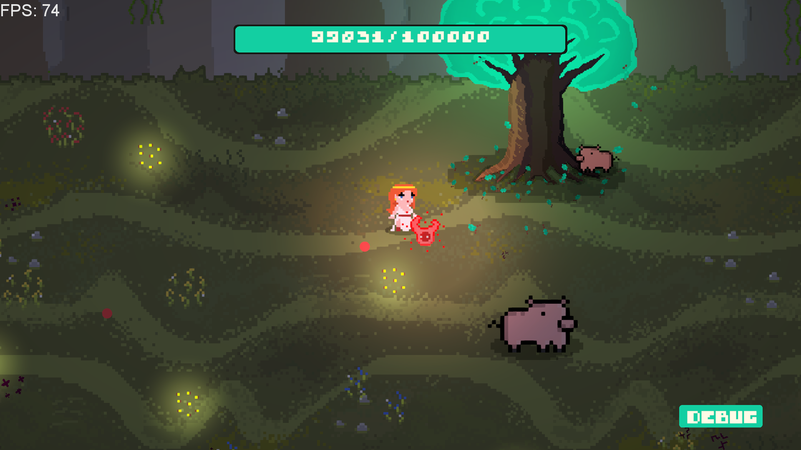
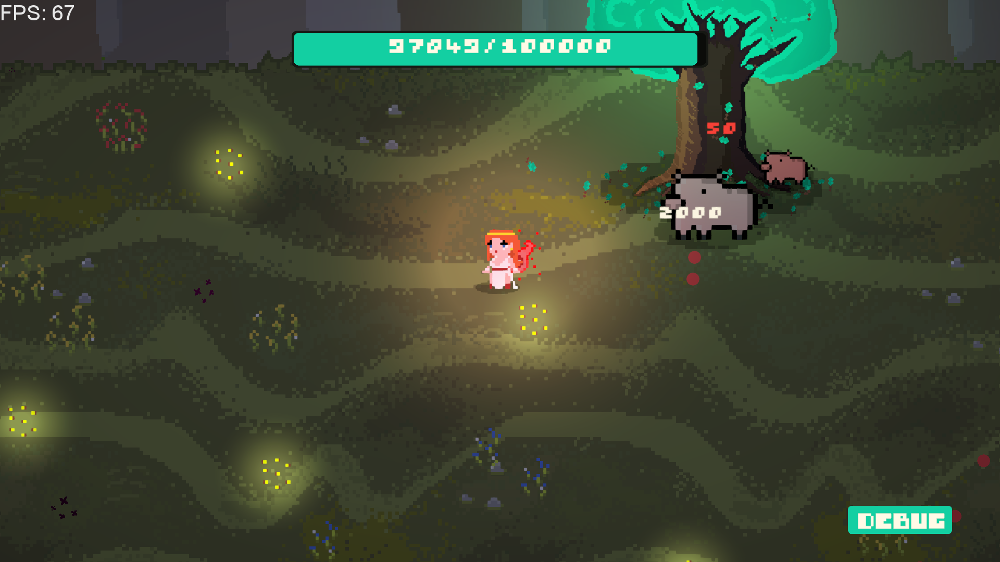
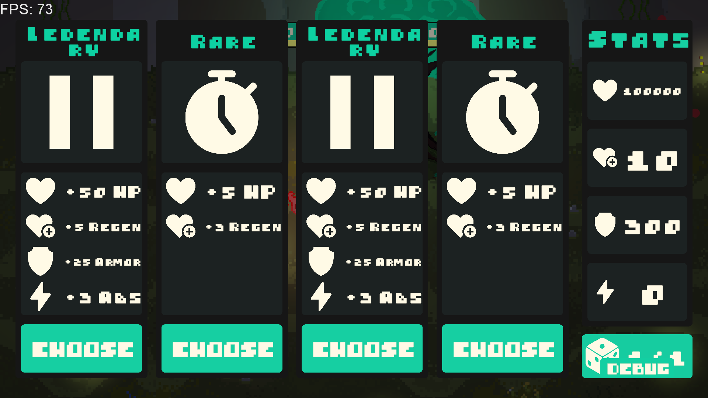
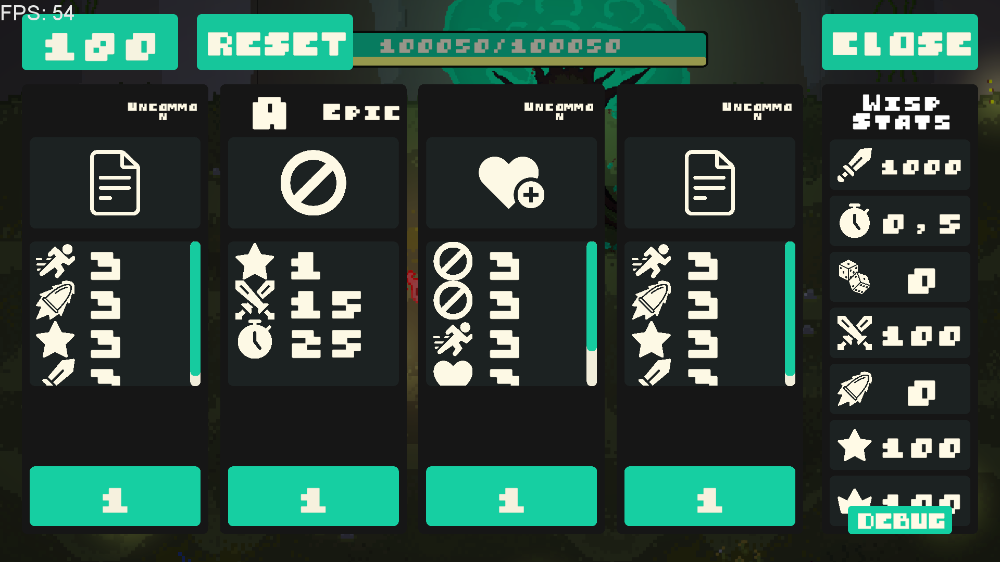

# Tree Arena 2 (ATD 2) | In development

This is a personal project. Tree Arena 2 is a 2D top-down singleplayer roguelite where you defend a tree from waves of enemies. I’m building this game mainly because I enjoy it, and because I wanted to challenge myself with flexible, scalable code and more advanced systems.

## About the game

The player controls a character who is followed by a wisp. The wisp automatically attacks enemies while the player moves around. Enemies come in waves, and after each wave you get a short break to upgrade stats or buy items.

There are many types of enemies and bosses, each with their own behavior and mechanics. Same goes for wisps — there are several of them, all different.

I’ve tried to keep everything modular and scalable — so adding new enemies, items, mechanics, or upgrades should be fast and easy later on.

## Key Features

- Roguelite wave-based gameplay
- Custom upgrade/shop system after each wave
- Multiple wisps with unique mechanics
- Bosses with special behaviors and attack patterns
- In-game console for debugging and spawning stuff (items, enemies, etc.)
- **...**

## Programm Patterns

- **Factory** (for spawning enemies, items, bullets)
- **Object Pool** (for bullets, coins, enemies)
- **State Machine** (used in one of the wisps)
- **Observer/Event System** (used throughout the game)
- **Decorator** (for adding new mechanics to wisps dynamically)
- **...**

## Screenshots & Preview (may take some time to load)

